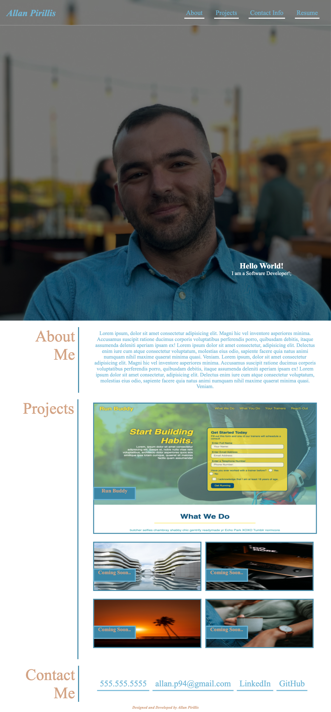

# 02-allanpirillisPortfolio

## About
Personal Portfolio for an assignment and future use also. 

It has been fun and interesting creating this long overdue portoflio for myself where i can showcase my personal touch on the website itself but also share some information about myself, projects i have worked on, but most importantly how to contact me!! 

---

## Direction
The personal portfolio is far from finished; as of 03.14.21 it has the core functionality that meets the acceptance criteria for the assignemnt. As more projects are started/completed they will be posted and updated on the portfolio. The portfolio is also an on going "try it here first" mentality website and will reflect my progress throughout my journey of becoming a Full Stack Web Developer and beyond. 

---

## Acceptance Criteria 
```
* GIVEN I need to sample a potential employee's previous work
* WHEN I load their portfolio
* THEN I am presented with the developer's name, a recent photo, and links to sections about them, their work, and how to contact them
* WHEN I click one of the links in the navigation
* THEN the UI scrolls to the corresponding section
* WHEN I click on the link to the section about their work
* THEN the UI scrolls to a section with titled images of the developer's applications
* WHEN I am presented with the developer's first application
* THEN that application's image should be larger in size than the others
* WHEN I click on the images of the applications
* THEN I am taken to that deployed application
* WHEN I resize the page or view the site on various screens and devices
* THEN I am presented with a responsive layout that adapts to my viewport
```
## Project Screenshots
### Max viewport of 575 


### Max viewport of 768


### Max viewport of 980


### Max viewport of 1024


## Link to Deployed Application

